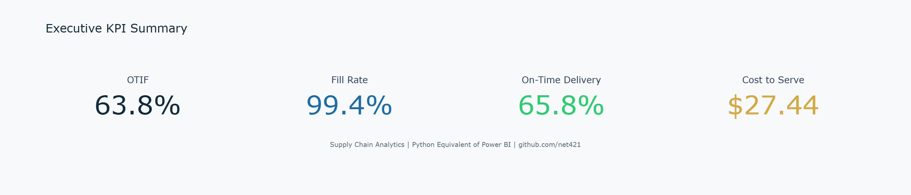
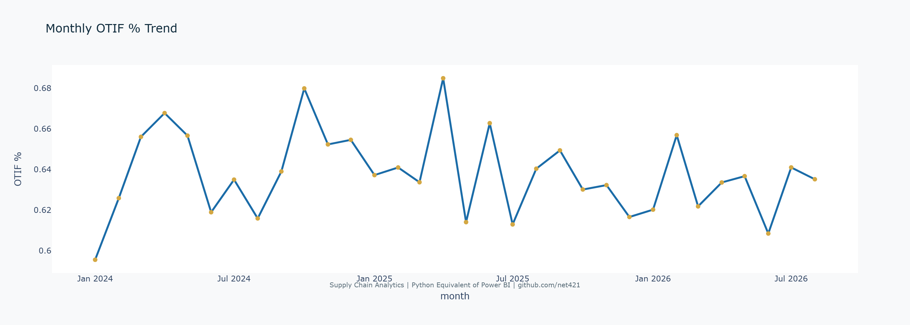
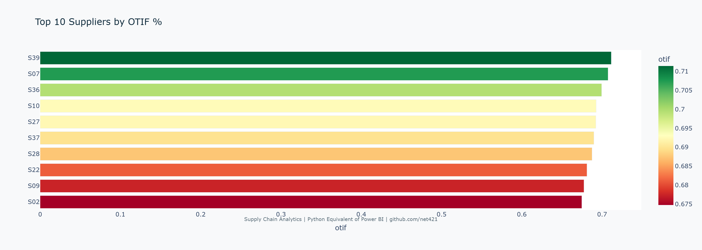
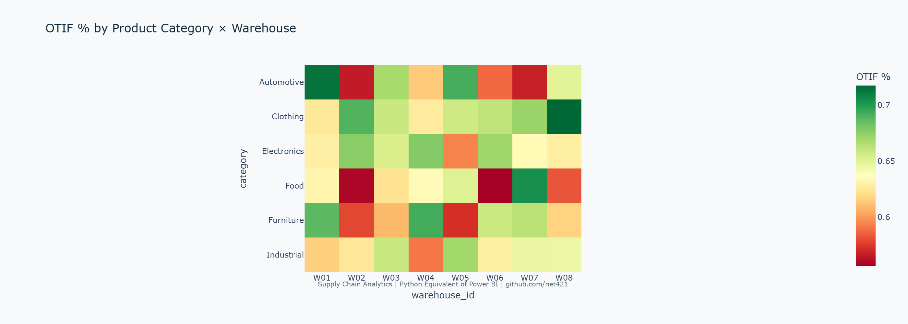
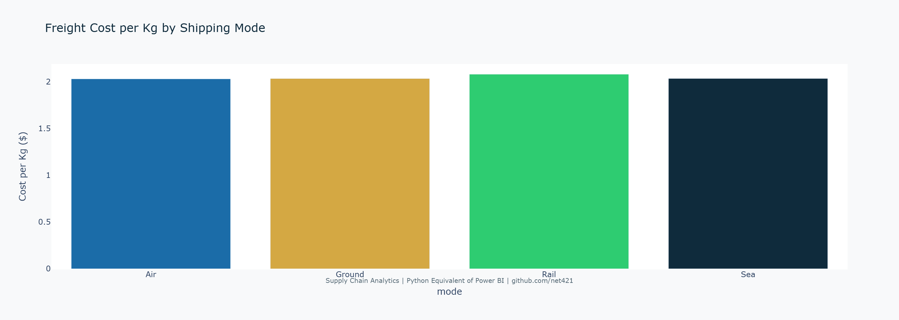
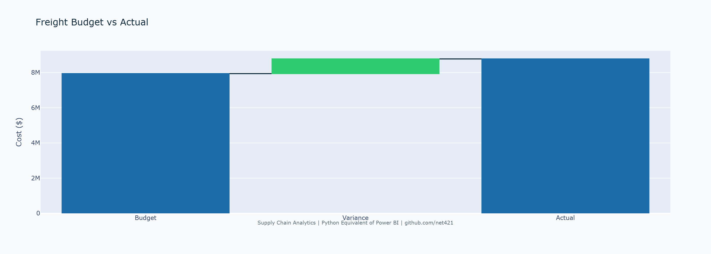

# Power BI Supply Chain Analytics

> Executive supply chain intelligence platform built with Power BI, advanced DAX, star-schema modeling, and synthetic operational data.


## Business Problem

Supply-chain leaders need one governed view of service level, inventory efficiency, transportation cost, and supplier reliability. This project provides the data model, DAX layer, validation framework, and dashboard specification required to build that solution in Power BI Desktop.

## Solution Overview

| Component | Design |
|---|---|
| Data model | Star schema with order, inventory, and shipping facts plus conformed dimensions |
| Orders | 10,000 synthetic records generated with Q4 seasonality, growth, 5% delay target, and 3% incomplete-delivery target |
| Products | 500 |
| Suppliers | 50 |
| Warehouses | 8 |
| DAX | Service, inventory, cost, time intelligence, ranking and scenario patterns |
| Dashboards | Executive, Operational, Cost Analysis |
| Validation | Referential integrity, date continuity, quantity and cost checks, KPI cross-checks |

## Repository Structure

```text
power-bi-supply-chain-analytics/
├── data/
│   ├── supply_chain_orders.csv
│   ├── products.csv
│   ├── suppliers.csv
│   ├── warehouses.csv
│   ├── inventory_levels.csv
│   └── shipping_costs.csv
├── model/
│   ├── README.md
│   └── relationships.md
├── dax/
│   ├── 01_service_kpis.md
│   ├── 02_inventory_kpis.md
│   ├── 03_cost_kpis.md
│   ├── 04_time_intelligence.md
│   ├── 05_rankings_scenarios.md
│   └── 06_advanced_patterns.md
├── dashboards/
│   └── dashboard_design_notes.md
├── validation/
│   ├── data_quality_checks.py
│   └── test_results.md
├── docs/
│   ├── data_dictionary.md
│   ├── business_requirements.md
│   ├── deployment_guide.md
│   └── methodology.md
├── scripts/
│   └── generate_supply_chain_data.py
├── .github/workflows/
│   └── generate-data.yml
├── LICENSE
└── README.md
```

## Data Model

The intended model is a star schema:

- `dim_date` → `fact_orders`, `fact_inventory`, `fact_shipping`
- `dim_product` → `fact_orders`, `fact_inventory`
- `dim_supplier` → `fact_orders`
- `dim_warehouse` → `fact_orders`, `fact_inventory`, `fact_shipping` as origin/destination roles
- `dim_shipping_mode` → `fact_shipping`

The Power BI `.pbix` binary is intentionally not generated outside Power BI Desktop. `model/README.md` contains the exact build instructions and relationship design.

## Synthetic Data

Generate the full 10,000-order dataset and supporting dimensions locally:

```bash
python scripts/generate_supply_chain_data.py
python validation/data_quality_checks.py
```

The generator is deterministic (`seed=42`) and explicitly targets:

- Q4 demand seasonality
- year-over-year growth
- approximately 5% delayed deliveries
- approximately 3% incomplete deliveries
- realistic unit costs, handling costs, quality scores, and lead times
- referentially valid product/supplier/warehouse keys

## DAX Layer

The `dax/` directory contains production-oriented measures for:

- OTIF, Fill Rate, On-Time Delivery, Perfect Order
- Inventory Turns, Days of Supply, Stockout Frequency, Inventory Risk
- Cost to Serve, Freight Cost/kg, Budget Variance
- YTD, prior-year, YoY, rolling average and MoM patterns
- Supplier ranking and lead-time scenario analysis

## Dashboards

### Executive
KPI cards, OTIF trend vs prior year, days-of-supply gauge, supplier ranking, and regional freight-cost view.

### Operational
Late-order exceptions, OTIF heatmap by category/warehouse, fill-rate vs inventory scatter, stockout root-cause view, and slicers.

### Cost Analysis
Freight budget variance, cost/kg by transport mode, freight trend, supplier/lane cost matrix, and decomposition-tree design.

## Validation

Run:

```bash
python validation/data_quality_checks.py
```

The validator checks row counts, null keys, date ordering, delivered ≤ ordered, non-negative costs, expected anomaly bands, and duplicate order IDs.

## Important Implementation Note

Power BI Desktop is required to create the final `.pbix` and render dashboard screenshots. This repository contains the reproducible source data, model specification, DAX, validation code, and dashboard design so the binary report can be assembled without hidden/manual logic.

## 📊 Dashboard Screenshots

### Executive Dashboard




### Operational Dashboard


### Cost Analysis Dashboard


## License

MIT License — see `LICENSE`.

## Author

**Emmanuel Beristain Guzman**  
Applied Data, Analytics & AI Engineer | Supply Chain & Decision Intelligence

GitHub: https://github.com/net421
